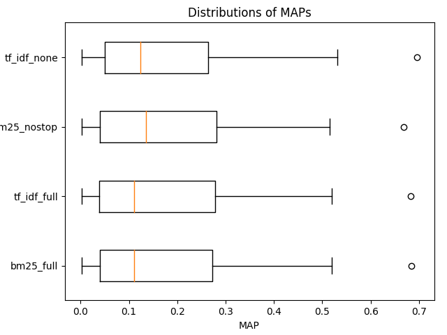

## Figures

### `iprc.png` - Interpolated Precision Recall Curve (@ recall levels)

#### Interpretation
The shape of the curves is very much expected,
> enforcing the notion that as more **relevant** documents are retrieved (recall increases), the more **nonrelevant** documents are retrieved (precision decreases) [[1]](https://trec.nist.gov/pubs/trec16/appendices/measures.pdf)

At `recall=0.2` and `recall=0.8` I drew two vertical dashed grey lines to ease the comparison among the systems (as suggested in [[1]](https://trec.nist.gov/pubs/trec16/appendices/measures.pdf)).

Judging by the plot we can see that performance levels are more or less the same except for the one system that performs slightly worse than the others in range `[0.2, 0.8]`.

The file listed below shows the Precision Recall Curve at different document cutoffs (`[5,10,15,20,30,100,200,500,1000]`). There are no major changes in the shapes of the curves with respect to the graph above.
- `prc.png` - [Precision Recall Curve (@ document cutoffs)](../figures/prc.png)
___

### `distr_maps.png` - Distribution of MAP values across the 50 topics (Boxplots)

#### Interpretation

Unfortunately the distribution of the measured MAP values on all the topics  is not that insightful. All systems' performances are very close to each other which suggests that there is no empirical proof of a _significant_ difference among them. At later stages it is actually verified that no system brings a statistically _significant_ improvement over the others.
Please note that "MAP" is just used for consistency with Terrier, the actual measure is "AP" or "Average Preicsion".

The files listed below show the distributions of RPrec and P@10 which are very similar to the graph above _interpretation-wise_.
- `distr_rprecs.png` - [Distribution of RPrecs values across the 50 topics (Boxplots)](../figures/distr_rprecs.png)
- `distr_precs_10.png` - [Distribution of P@10s values across the 50 topics (Boxplots)](../figures/distr_precs_10.png)
___

### `tukey_maps.png` - TODO: non l'ho ancora capito

#### Interpretation

The files listed below show the *TODO: non l'ho ancora* capito which are very similar _interpretation-wise_.
- `distr_rprecs.png` - [*TODO: non l'ho ancora capito*](../figures/tukey_rprecs.png)
- `distr_precs_10.png` - [*TODO:* non l'ho ancora capito*](../figures/tukey_precs_10.png)
