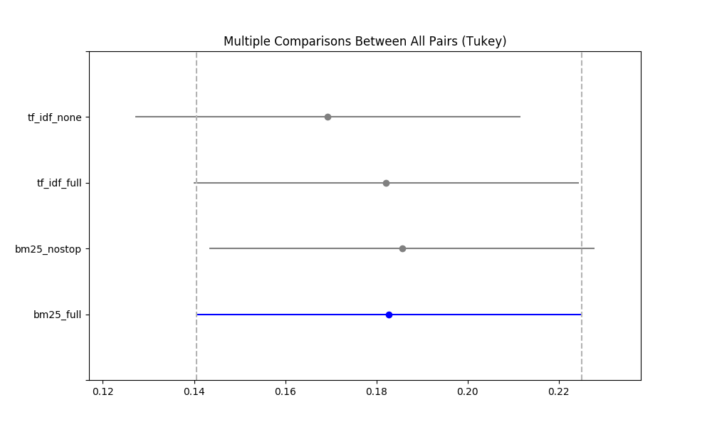

## Figures

### `iprc.png` - Interpolated Precision Recall Curve (@ recall levels)

#### Interpretation
The shape of the curves is very much expected. Recall (x-axis) measures the fraction of relevant documents retrieved with respect to total number of documents. This means that as long as I retrieve relevant documents, it does not really matter how many irrelevant documents I retrieve to do so. Therefore we see that for high values of recall we get poor values of precision. I marked with 2 vertical grey dashed lines (at 0.2 and at 0.8) the areas in which we should compare the models as reported in [linkobello]

The file listed below shows the Precision Recall Curve at different document cutoffs (`[5,10,15,20,30,100,200,500,1000]`). While the graph is a little bit more fine graned, there are no major changes in the shapes of the curves with respect to the graph above.
- `prc.png` - [Precision Recall Curve (@ document cutoffs)](../figures/prc.png)
___

### `distr_maps.png` - Distribution of MAP values across the 50 topics (Boxplots)

#### Interpretation

The files listed below show the distributions of RPrec and P@10 which are very similar to the graph above _interpretation-wise_.
- `distr_rprecs.png` - [Distribution of RPrecs values across the 50 topics (Boxplots)](../figures/distr_rprecs.png)
- `distr_precs_10.png` - [Distribution of P@10s values across the 50 topics (Boxplots)](../figures/distr_precs_10.png)
___

### `tukey_maps.png` - TODO: non l'ho ancora capito

#### Interpretation

The files listed below show the *TODO: non l'ho ancora* capito which are very similar _interpretation-wise_.
- `distr_rprecs.png` - [*TODO: non l'ho ancora capito*](../figures/tukey_rprecs.png)
- `distr_precs_10.png` - [*TODO:* non l'ho ancora capito*](../figures/tukey_precs_10.png)
