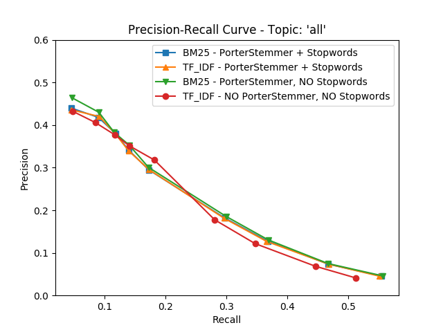
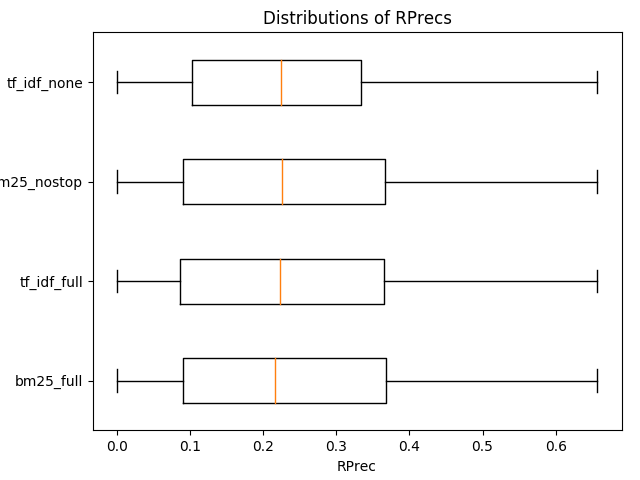

## Figures

### `prc.png` - Precision Recall Curve

___

### `iprc.png` - Interpolated Precision Recall Curve

___

### `distr_maps.png` - Distribution of MAP values across the 50 topics (Boxplots)

___

### `distr_rprecs.png` - Distribution of RPrecs values across the 50 topics (Boxplots)

___

### `distr_precs_10.png` - Distribution of P@10s values across the 50 topics (Boxplots)

___
